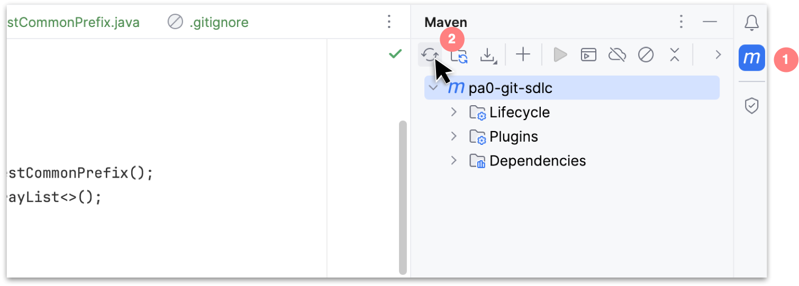
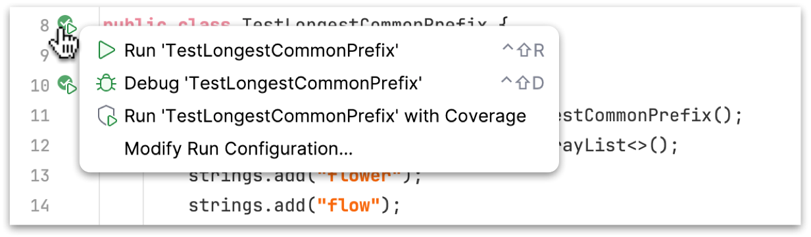

# `git`, the SDLC, and TDD -- oh my!

In this initial "pseudo-ish" :-) programming assignment, you'll practice debugging, test driven-development (TDD), and generally familiarize yourself in working with git and the terminal. I  recommend starting on this early in the event that you encounter process related issues -- such as commiting and/or pushing your work. 

This is to say: give yourself time to reach out to me or one of the course LAs/IAs/TAs.

## Part 1: Test Driven Development (TDD)

In this first part you'll practice: running tests, writing tests, identifying bugs using tests, and implementing corresponding fixes. You'll also learn some basic aspects of project maintenance (specifically related to dependencies and build scripts). 

First, `cd` into the directory where you are storing your work for 311 this semester and clone this repo. Next, open the cloned repo in IntelliJ (`File > Open` then navigate to the cloned project folder on your hard drive). 

> Consult `M02-L03-Git and Terminal` on canvas for notes on working with the terminal and git (on macOS and Windows). 

### Code Specification:

We are solving a classic interview problem, finding the longest prefix in an ArrayList of Strings. These types of problems feature heavily in interviews, as do problems involving String manipulation in general. Here is the problem statement for the longest common prefix problem:

> You must find the longest common prefix in an array of Strings. If there is no common prefix, return an empty string (i.e. ""). If there is a common prefix, return it as a String

#### Some examples:

- in this array ["flower", "flow", "flight"], we would return "fl" as the longest common prefix
- in this array ["flower", "flow"], we would return "flow"
- ["dog", "racecar", "car"], we would return ""
- in this array [], we would return "" as there are no strings at all

### Step 0: adding `jUnit` as a dependency

Rather than using the version of jUnit packaged with IntelliJ (as one of the lesson videos did), the starter kit for this repo includes a **maven** `pom.xml` in the root directory of your cloned repo. There are build tools out there for Java (some more complicated than others) though maven is pretty much the de-facto standard, followed closely by **gradle**. 

Most real projects  maintain a *build script* -- even small to medium sized ones. A build script defines how executables for the project get built and also declares (and automatically) pulls in any library dependencies for your project. A simple, well written, and easy to understand build script is a durable way of managing codebases long term (especially those that are reliant on many different libraries). 

First: you'll need to add a dependency for jUnit to the skeleton `pom.xml` included in the starter kit. Go to the maven (mvn) central repo [here](https://mvnrepository.com/) and search for 'jUnit'. Select the one near the top with "jupiter api" in the title. Select whatever the most recent version is (for me, it's `5.10.1`). Once you click the version on the website, you should be taken to a page containing containing a snippet like:

```
<dependency>
    <groupId>org.junit.jupiter</groupId>
    <!-- more will be here in the real dep. on mvn central repo -->
</dependency>
```
Copy the above (it'll have a little more -- like the version) and paste it within the`<dependencies>` block in your pom:

```
<dependencies>
    <!-- paste your jUnit jupiter dependency here -->
</dependencies>
```

Once you add this dependency, expand the tool window for maven and click reload:



This should pull in the jUnit dependency you added to the `pom.xml`. Once you do this, the `test` folder should turn a light green color (incidicating its now a recognized 'test' directory that mirrors the setup of your source 'src' directory) + the errors with the imports in the `TestLongestCommonPrefix` file should be gone.

### Step 1: review the existing prefix-finding code

In the blue `src` folder in the starter kit for this repo, you'll find an existing solution. Existing test cases are located in the green `test` folder.

At this point, since you've added the depedency and reloaded the maven project, you should be able to run the tests. Ensure that they pass (you should see green play buttons in the gutter):



### Step 2: adding a test

Now add a *new* test where you pass an empty ArrayList to the `findLongestCommonPrefix` method. This test will fail, in fact, running the test should trigger a runtime exception (an `IndexOutOfBoundsException` to be precise). Figure out how to fix this.. hint: the method `findLongestCommonPrefix` should return an empty string ("") if there are no elements in the ArrayList. Include at least one assert in your added test.

### Step 3: (optional fun) 

Add some additional unit tests to improve code coverage for the prefix-finding method to increase confidence that the algorithm (as written) is working correctly. If you add a test and you find that it is failing when it should pass -- try to identify and fix the bug in the longest prefix algorithm. If you find a bug, but can't figure out how to adapt the algorithm, keep the failing test(s) around (though please comment out any failing tests out when you submit your work).

## Part 2: Reflections on Agile, the Software Development Lifecycle (SDLC), and Process Modeling

From the Meyer course text, read the preface, chapter 1, and chapter 3, and section 7.5 (on TDD). 

Write a reflection - 3/4 of a page - outlining Meyer's view on Agile methods, some of the benefits, and what the author considers some of the downsides. Discuss at least two alternative (existing) SDLC process models. Include what Meyer thinks of the Waterfall process model (what's one minor 'upside' he attributes to it)? Include in your answer some of his identified criticisms of TDD -- does Meyer's characterization match the approach discussed in the `M02-L02` lecture?

Submit your reflection as a `.pdf` or `.md` ([markdown file](https://docs.github.com/en/get-started/writing-on-github/getting-started-with-writing-and-formatting-on-github/basic-writing-and-formatting-syntax)) in the root directory of this project -- be sure you commit your document to version control. You can tell if it's properly added by looking at your project repo on github.

# Handin

When you are ready to submit (or simply want to 'checkin' your work for the day), open the terminal, cd to the project directory, make make a commit by typing:

> git commit -am "message goes here"

then follow this up with a

> git push origin main
